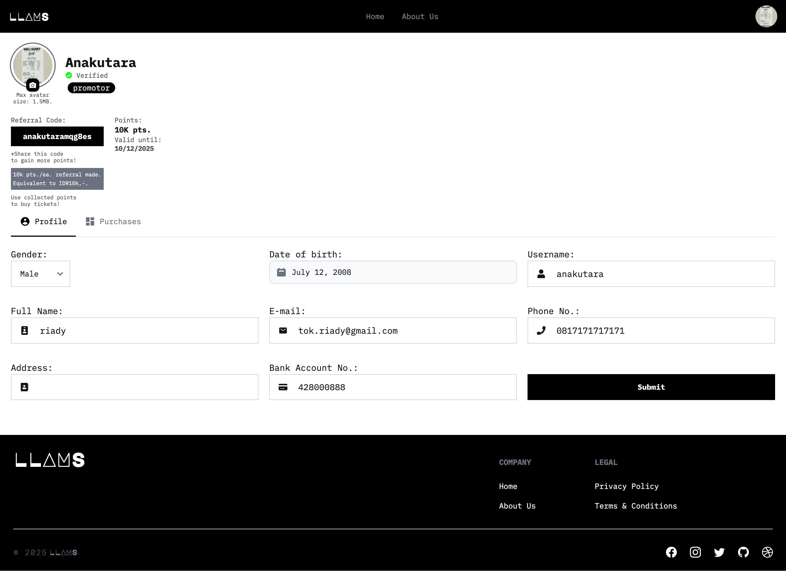

# 🎫 LLAMS – Event Ticketing MVP (Purwadhika Fullstack Web Development Bootcamp Mini Project)

LLAMS is a full-stack event ticketing web app built as a bootcamp capstone mini project. It features role-based access for customers and promotors, secure authentication flows, and real-world constraints for event management and ticket purchases.

This version includes post-bootcamp improvements such as a Dockerized Postgres setup, avatar preview UX, and data schema migration from MySQL to PostgreSQL.

---

## 🚀 Features

- 🔐 **JWT Authentication**: Sign up, sign in, sign out, email verification, password reset
- 🧑 **User Profile Dashboard**: Edit profile, view transactions, upload payment proof
- 🔁 **Role Upgrade Flow**: Customers can become promotors by submitting bank details
- 🎤 **Promotor Dashboard**:
  - View and manage created events
  - Approve customer transactions by reviewing uploaded receipts
  - See event favorites chart (filterable)
- 💰 **Referral & Rewards System**:
  - Unique referral codes grant Rp10K credit (points) to the referrer
  - 10% one-time voucher for new users who sign up with a code
- ✅ **Purchase Rules Enforced**:
  - Promotors can't buy tickets to their own events
  - One-time ticket purchase limit per user per event
- 🐳 **Dockerized PostgreSQL Setup** for local development using Colima

---

## 🖼️ Screenshots

| Feature                        | Preview                            |
|-------------------------------|------------------------------------|
| 🔠Login Page                 |  |
| 👤 Edit Profile + Avatar      |  |
| 💸 Customer Dashboard         |  |
| ⚙️ Role Upgrade (to Promotor) |  |
| 🤠Promotor Dashboard         |  |
| 📊 Favorite Categories Chart  |  |
| 🏷️ Referral Code & Voucher    |  |

> _Note: Sample data is limited for clarity. The app supports full multi-event, multi-transaction workflows._

---

## 🛠️ Tech Stack

**Frontend**:  
- Next.js 14  
- Tailwind CSS  
- Flowbite React  

**Backend**:  
- Express.js  
- REST API  
- JWT-based auth  
- Prisma 5 ORM  
- PostgreSQL 16 (Dockerized via Colima)  

**DevOps**:  
- Docker & Docker Compose (Postgres only)  
- GitHub branching strategy (`init`, `development`, `main`)

---

## 📦 Running Locally

> You need Docker & Colima installed.

```bash
# Start PostgreSQL via Docker
docker-compose up -d

# Install dependencies (client & server)
cd client && npm install
cd ../server && npm install

# Run both apps in separate terminals
cd client && npm run dev
cd ../server && npm run dev
